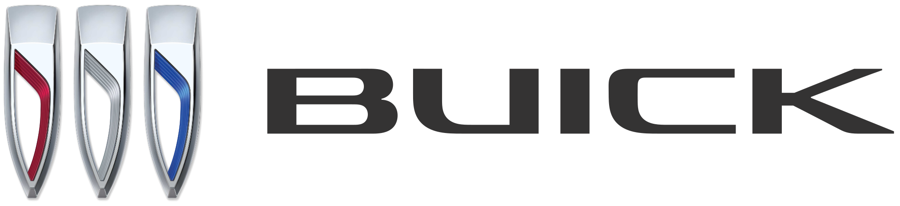
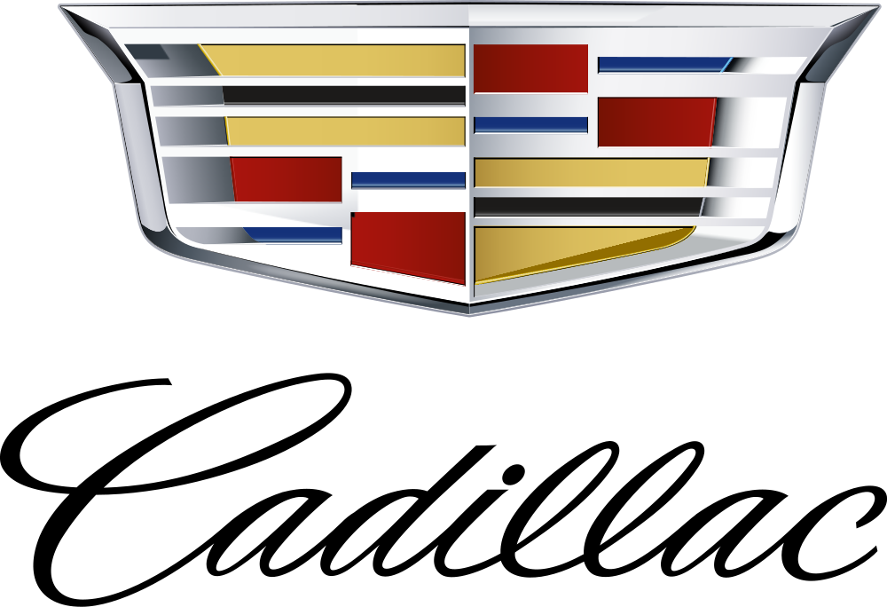

# Car Logos SVG

A curated collection of **47 car manufacturer logos** in SVG format, focused on brands actively sold in the US market. Includes a structured `data.json` file with metadata for each brand.

## Preview

| Brand | Logo | Country | Parent Company |
|-------|------|---------|----------------|
| Acura |  | Japan | Honda Motor Company |
| Alfa Romeo |  | Italy | Stellantis |
| Aston Martin |  | UK | Aston Martin Lagonda |
| Audi |  | Germany | Volkswagen Group |
| Bentley |  | UK | Volkswagen Group |
| BMW |  | Germany | BMW Group |
| Buick |  | USA | General Motors |
| BYD |  | China | BYD Company |
| Cadillac |  | USA | General Motors |
| Chevrolet |  | USA | General Motors |
| Chrysler |  | USA | Stellantis |
| Dodge |  | USA | Stellantis |
| Ferrari |  | Italy | Ferrari N.V. |
| Fiat |  | Italy | Stellantis |
| Ford |  | USA | Ford Motor Company |
| Genesis |  | South Korea | Hyundai Motor Group |
| GMC |  | USA | General Motors |
| Honda |  | Japan | Honda Motor Company |
| Hyundai |  | South Korea | Hyundai Motor Group |
| Infiniti |  | Japan | Nissan Motor Company |
| Jaguar |  | UK | Tata Motors (JLR) |
| Jeep |  | USA | Stellantis |
| Kia |  | South Korea | Hyundai Motor Group |
| Lamborghini |  | Italy | Volkswagen Group |
| Land Rover |  | UK | Tata Motors (JLR) |
| Lexus |  | Japan | Toyota Motor Corporation |
| Lincoln |  | USA | Ford Motor Company |
| Lotus |  | UK | Geely |
| Lucid |  | USA | Lucid Group |
| Maserati |  | Italy | Stellantis |
| Mazda |  | Japan | Mazda Motor Corporation |
| McLaren |  | UK | McLaren Automotive |
| Mercedes-Benz |  | Germany | Mercedes-Benz Group |
| Mini |  | UK | BMW Group |
| Mitsubishi |  | Japan | Nissan-Renault-Mitsubishi Alliance |
| Nissan |  | Japan | Nissan Motor Company |
| Polestar |  | Sweden | Geely / Volvo Cars |
| Porsche |  | Germany | Volkswagen Group |
| Ram |  | USA | Stellantis |
| Rivian |  | USA | Rivian Automotive |
| Rolls-Royce |  | UK | BMW Group |
| Subaru |  | Japan | Subaru Corporation |
| Tesla |  | USA | Tesla, Inc. |
| Toyota |  | Japan | Toyota Motor Corporation |
| VinFast |  | Vietnam | Vingroup |
| Volkswagen |  | Germany | Volkswagen Group |
| Volvo |  | Sweden | Geely |

## Structure

```
car-logos-svg/
├── logos/              # SVG logo files (one per brand)
│   ├── acura.svg
│   ├── alfa-romeo.svg
│   ├── audi.svg
│   ├── bmw.svg
│   ├── ...
│   └── volvo.svg
├── data.json           # Structured metadata for all brands
├── package.json        # npm package metadata
├── LICENSE             # MIT License
└── README.md
```

## Data Format

`data.json` contains an array of brand objects:

```json
[
  {
    "name": "Toyota",
    "slug": "toyota",
    "country": "Japan",
    "parent_company": "Toyota Motor Corporation",
    "image": {
      "svg": "./logos/toyota.svg"
    }
  }
]
```

### Fields

| Field | Type | Description |
|-------|------|-------------|
| `name` | string | Display name of the brand |
| `slug` | string | URL-safe identifier (used as filename) |
| `country` | string | Country of origin |
| `parent_company` | string | Parent company or corporate group |
| `image.svg` | string | Relative path to the SVG file |

## Usage

### JavaScript / Node.js

```javascript
import brands from './data.json';

// Get all brand names
const names = brands.map(b => b.name);

// Find a specific brand
const toyota = brands.find(b => b.slug === 'toyota');
console.log(toyota.image.svg); // "./logos/toyota.svg"

// Filter by country
const japanese = brands.filter(b => b.country === 'Japan');

// Filter by parent company
const vwGroup = brands.filter(b => b.parent_company === 'Volkswagen Group');
```

### HTML

```html

```

### React

```jsx
import brands from './data.json';

function BrandLogo({ slug }) {
  const brand = brands.find(b => b.slug === slug);
  return ;
}
```

## Coverage

**47 brands** across **10 countries**:

| Country | Count | Brands |
|---------|-------|--------|
| United States | 13 | Buick, Cadillac, Chevrolet, Chrysler, Dodge, Ford, GMC, Jeep, Lincoln, Lucid, Ram, Rivian, Tesla |
| Japan | 9 | Acura, Honda, Infiniti, Lexus, Mazda, Mitsubishi, Nissan, Subaru, Toyota |
| United Kingdom | 8 | Aston Martin, Bentley, Jaguar, Land Rover, Lotus, McLaren, Mini, Rolls-Royce |
| Germany | 5 | Audi, BMW, Mercedes-Benz, Porsche, Volkswagen |
| Italy | 5 | Alfa Romeo, Ferrari, Fiat, Lamborghini, Maserati |
| South Korea | 3 | Genesis, Hyundai, Kia |
| Sweden | 2 | Polestar, Volvo |
| China | 1 | BYD |
| Vietnam | 1 | VinFast |

## Sources

SVG logos sourced from [Wikimedia Commons](https://commons.wikimedia.org/) under their respective licenses. Individual logo trademarks belong to their respective owners.

## License

This repository's code and data structure are released under the [MIT License](LICENSE). The logos themselves are trademarks of their respective companies and are included for identification purposes only.
